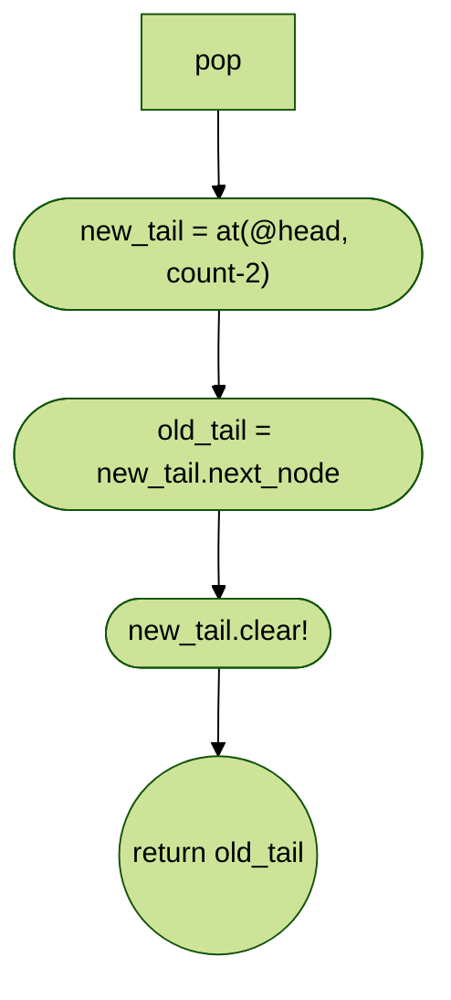

# TOP-ruby-linked_list

## What is a Linked List?

A Linked List is a data structure that allocates pieces of memory randomly to
store data using a series of Nodes that hold their data value and either a
pointer to the next node both a pointer to the next node and the previous node.

The Linked List holds a reference to the first node, which is knowns as the **head**.  The end of the list is a node that points to a **null**(**nil**) value. Because of the way the linked list is structured, this allows for a list of any length to be stored dynamically in memory - Unlike other linear data structures like Arrays, Linked lists do **NOT** require a contiguous block of memory to be addressed to store the entire list.

---

### Basic structure of a node


Or


--- 

### Basic structure of a linked list


Because of the simple nature of a linked list tracking only the head node and methods for manipulating the list (traversal, finding, putting new items on the list or removing items from the list), it becomes very evident how memory efficient linked lists are.  If you are storing five or ten items in a list, an Array is probably a better approach for implementation.  However, if you are storing tens of thousands or millions of items in a list, a linked list becomes a very attractive way of storing information.

<br/>
<br/>


---


# The Assignment

For our linked list assignment from [The Odin Project](https://www.theodinproject.com/lessons/ruby-linked-lists), our linked list will need to be able to do the following:

1. `#append(value)`             - add a new node containing `value` to the end of the list
2. `#prepend(value)`            - add a new node containing `value` to the start of the list
3. `#size`                      - return the total number of nodes in the list
4. `#head`                      - return the first node in the list
5. `#tail`                      - return the last node in the list
6. `#at(index)`                 - return the node at the given index
7. `#pop`                       - remove the last element from the list
8. `#include?(value)`           - return true if the passed in `value` is in the list, otherwise return false.
9. `#find(value)`               - return the index of the node containing `value`, or `nil` if not found.
10. `#to_s`                     - represent your LinkedList objects as strings, so you can print them out and preview them in the console.  The format should be: `( value ) -> ( value ) -> ( value ) -> nil`
11. `#insert_at(value, index)`  - insert a new node with the provided `value` at the given `index`
12. `#remove_at(index)`         - remove the node at the given `index`.


## Append

`LinkedList.append(node)` adds an item to the tail end of the list. First check if the list is empty.  If the list is empty, create a node and make it the head of the list.  If the list is not empty, create a new node and make it the tail of the list.


## Prepend

`LinkedList.prepend(node)` adds an item to the head of the list. First create a new node, then set the `next_node` value of that new node to the current value of `head`, then set the current value of head to the node just created.


## Size

`LinkedList.size`||`LinkedList.count`||`LinkedList.length`, first check if the list is empty.  If the list is empty return a list size of `0`.  If the list is not empty, then recursively count each node in the list and return that count.


*Note:* Here you'll see that we call `count_node` with the value of the current head and the start of our counting variable.  The count_node method (private) looks like this:

### count_node

This is a private method


## Head

`LinkedList.head` returns the node that is at the head of the linked list.


## Tail

`LinkedList.tail` returns the node that is at the tail of the linked list.  Due to the linear nature of linked lists, it will recursively search the list from the head to the tail.  In a doubly linked list, the tail node will also be tracked on the linked list object and the call would simply return that value.  Since we are only implementing a singly linked list, we will use the recursive location method.  The tail node is indicated by its `next_node` being set to `nil`.


## At

`LinkedList.at(int)` finds and returns the value at a certain position in the list. This will work via the `find_node` private method, which recursively searches the list until it has traversed `index` number of items into the list.  This assumes that we are starting the list from `0`.


## Pop

`LinkedList.pop` removes and returns the last (tail) element from the list.  First set the `new_tail` as being the node that is in the -2 position (the node behind the current tail).  We then set the old_tail to the value of whatever is in `next_node` of the current `new_tail`.  Once that is done, we call the clear! method on the new_tail to empty the pointer and break the link, freeing the old tail for garbage collection, then return the `old_tail` node.



## Include?

`LinkedList.include?(value)` returns `true` if the list contains `value` or `false` if it does not. Recurse the list and return `true` if `node.data == value`, else return `false`.


## Find

`LinkedList.find(value)` locates `value` in the list and returns its `data`. It does this by recursing the list while keeping a count of each time the function calls itself until it hits the guard clause `return count if value == @data`.


## To_s

`LinkedList.to_s` represents the entire list as a string.  The formatting will follow this syntax:

`( value ) -> ( value ) -> ( value ) -> ( value ) -> nil`

To do this, we will first need to check if the list is empty.  If so, we return `0`.  If not, then we will call a private method `stringify_node(head.next_node, sentence_starter)` where `sentence_starter` is a private method that outputs the head node as `( value )` and then recurses to the bounding index or tail of the list. 


<br />
<br />


<br/>

### A note about stringify
Due to my limitations with mermaid, I will diagram out the stringify function here for clarity's sake.  The retun from the second test will recurse either way, whether start > 0 or not.  However, because we want to be able to stringify subsections of the list, we have to test if the call has been passed with a starting index to display from.  If so, then we need to test to see if our current recursion level (counter) is equal or greater than that starting point.  If so, we concat the current node together into the sentence we are building and pass it along to the next call.  If start is not equal to or greater than counter, we simply recurse without adding to the sentence.  The default start position is 0 unless passed by the caller.  Because we are also allowing a caller to pass a subsection of the list: `stringify(node, sentence, start, terminal)` we need to test of the current node is the last one we want.  We do this by comparing `terminal == counter`.  If it is, we concat and return the sentence, if not, we continue the recursion.

<br/>

```
def stringify_node(node, sentence, start=0, terminal = nil, counter = 1)
  return concat(sentence, node, tail=true) if node.tail? || terminal == counter

  stringify_node(
    node.next_node,
    concat(sentence, node),
    start, 
    terminal, 
    counter ++1) if start <= counter

  stringify_node(
    node.next_node,
    sentence,start, 
    terminal,
    counter += 1,)
end
```

### Concat

`LinkedList.concat(sentence, node)` is a private method that returns a string representation of the currently built sentence and the string representation of the value stored in the node.


This is the basic functionality of Concat, and while it makes sense, I will probably end up cleaning it up by packaging the sentence into a variable and just returning that at the end of the function since we don't need to recurse here.

## Insert_at
`LinkedList.insert_at(position,node)` is a public method that allows the insertion of a node into the list at a specific point within the list. To do this, we must create a new node, then get the node position that will be to the right of that node in the variable `next_node`.  Once we have the position of the right node (the node that will come after the newly created node in the list), we can then set the position of this current node to the node that will sit to the left of the node we just created (`position - 1`), then set the value of `next_node` on the newly created node to the value `next_node`.  After that, we just return the value of the newly created node.


## Remove_at
`LinkedList.remove_at(position)` is a public method that allows the removal of a node from the list at a specific point within that list.  To do this, we must traverse the list to that point in the list, get the value of the `next_node` from that point and set it to the previous node's `next_node` value and return the value of that node.  This severs the object out of the linked list and frees up that object for garbage collection if the value of it is not referenced anywhere else in memory.


